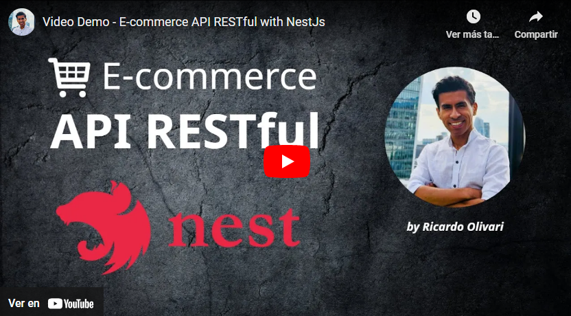

# Ecommerce NestJs API

Welcome to the Ecommerce API developed with NestJS! This backend project focuses on providing a robust and scalable API for an ecommerce website.

## Tech Stack

**Server:** 
- **Language:** TypeScript
- **Framework:** Node.js, Express, NestJS
- **Testing:** JestJS
- **Security:** JWT (JSON Web Tokens)
- **Database:** Postgres, TypeORM
- **Documentation:** Swagger
- **Containerization:** Docker

## Features

- **Authentication and Authorization:** Secure implementation with JWT.
- **Product Management:** Full CRUD for products.
- **User Management:** User registration, login, and administration.
- **Order Management:** Processing and tracking of orders.
- **API Documentation:** Interactive interface generated with Swagger.
- **Development Environment:** Containerized with Docker for easy deployment.

## Authors

- [@ricardoaot](https://www.github.com/ricardoaot)

## Demo
**Disclaimer**: This project was deployed on a free tier of Render by Vercel. Low performance in loading is expected.
- [View Demo](https://nest-ecommerce-am4b.onrender.com/api) <!-- Insert your demo link here -->

## Screenshots


## Video demo explanation

[](https://www.youtube.com/embed/PKj9LXgJFwY)


## Usage/Examples

Here's a quick example of how to consume this API from a frontend:

```typescript
import axios from 'axios';

async function fetchProducts() {
  const response = await axios.get('https://nest-ecommerce-am4b.onrender.com/products?limit=5&page=1');
  console.log(response.data);
}

fetchProducts();
```

## Installation

Clone the repository and use npm to install the dependencies:

```bash
git clone https://github.com/ricardoaot/nestjs-back-ecommerce
cd my-project
npm install
```

## Configuration

Set up the necessary environment variables. You can use the `.env.example` file as a reference and create your own `.env` file.

## Running

To start the server in development mode:

```bash
npm run start:dev
```

To start the server in production mode:

```bash
npm run start:prod
```

## Running Tests

To run tests, use the following command:

```bash
npm run test
```

## Contributing

Contributions are welcome! If you want to contribute, please follow these steps:

1. Fork the project.
2. Create a branch for your feature (`git checkout -b feature/your-feature`).
3. Commit your changes (`git commit -m 'Add new feature'`).
4. Push to the branch (`git push origin feature/your-feature`).
5. Open a Pull Request.

## License

This project is licensed under the MIT License. See the [LICENSE](LICENSE) file for details.

